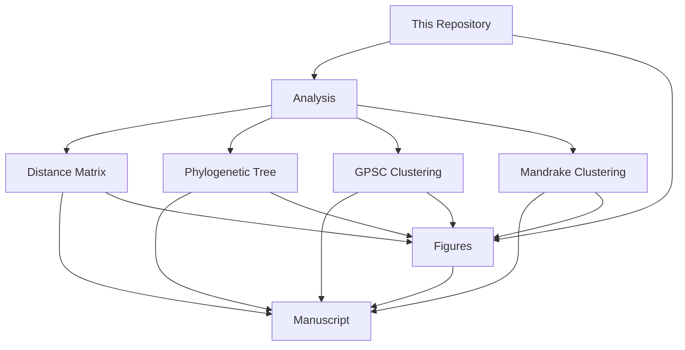

<h1 align="center">
  Pneumococcal Genome Library cgMLST Typing Scheme
</h1>

  

  

# Overview
This repository contains the code used to run analyses and generate figures for the following manuscript:  

<a href="www.page.com">*Microbial Genomics*</a>

  

>[!WARNING]
>Link not available yet - will be updated once manuscript goes live...  

> [!NOTE]  
> This repository contains modified code from the original repository that accompanied the pre-print publication in [bioRxiv](https://www.biorxiv.org/content/10.1101/2023.12.19.571883v1). The original repository and code was authored by [Duncan Burger](https://github.com/duncanberger). To view the original repository, please click on the following links:
> |[Brueggemann Lab (forked) Repository](https://github.com/brueggemann-lab/PGL_cgMLST) | [Duncan Burger's Repository](https://github.com/duncanberger/PGL_cgMLST)|
> |-------------------------------------------------------------------------------------|-------------------------------------------------------------------------|   

# Codebook
This repository contains two main folders: `Analysis` and `Figures`. 

View folder contents

<ol>
  <li>Analysis - contains the code used to generate:</li>
  <ol>
      <li>the distance matrix</li>
      <li>the phylogenetic tree</li>
    <li>GPSC and Mandrake clustering</li>
    </ol>
  <li>Figures - contains the R code in markdown format used to generate main and supplementary figures</li>
</ol>

# License
Distributed under the GNU General Public License v3.0. Please see `LICENSE` for more information.
## Publication History
|**Publication**|**DOI**|
|-------------------------------|------|
|[*bioRxiv 2023*](https://www.biorxiv.org/content/10.1101/2023.12.19.571883v1)||  

>[!TIP]
>**Reference**: Jansen van Rensburg MJ, Berger DJ, Fohrmann A, Bray JE, Jolley KA, Maiden MC, Brueggemann AB. Development of the Pneumococcal Genome Library, a core genome multilocus sequence typing scheme, and a taxonomic life identification number barcoding system to investigate and define pneumococcal population structure. bioRxiv. 2023:2023-12.
# Contact
If you have any queries, suggestions or concerns, please contact [Professor Angela Brueggemann](mailto:angela.brueggemann@ndph.ox.ac.uk)  

|Repository `PRIVATE` status since: 29/05/2024|
|--------------------------------------------|
